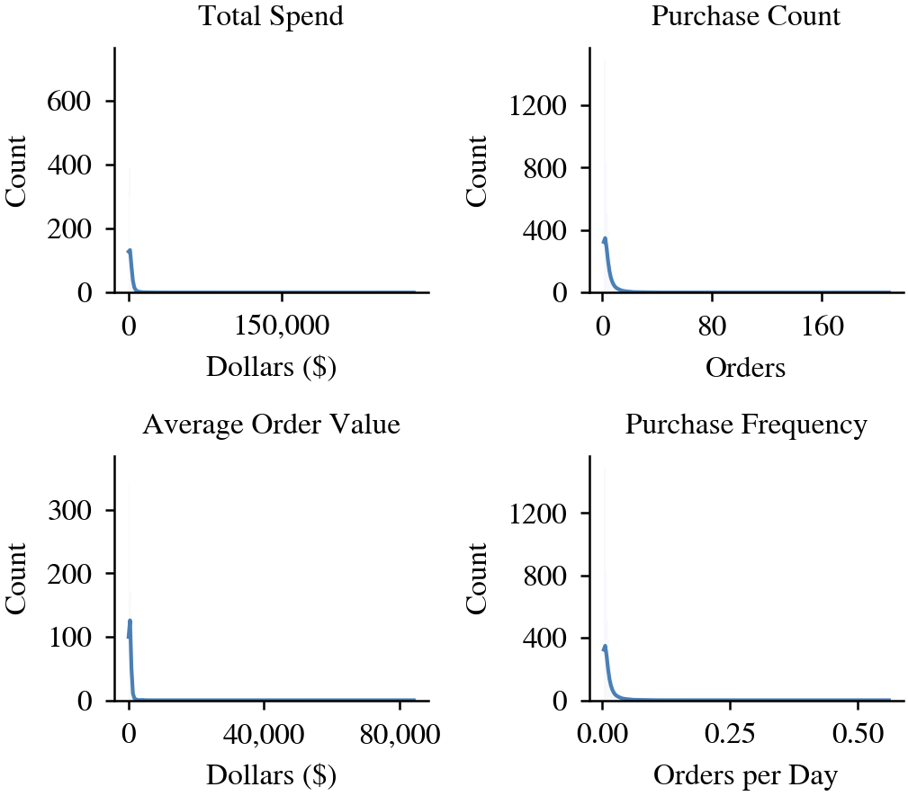
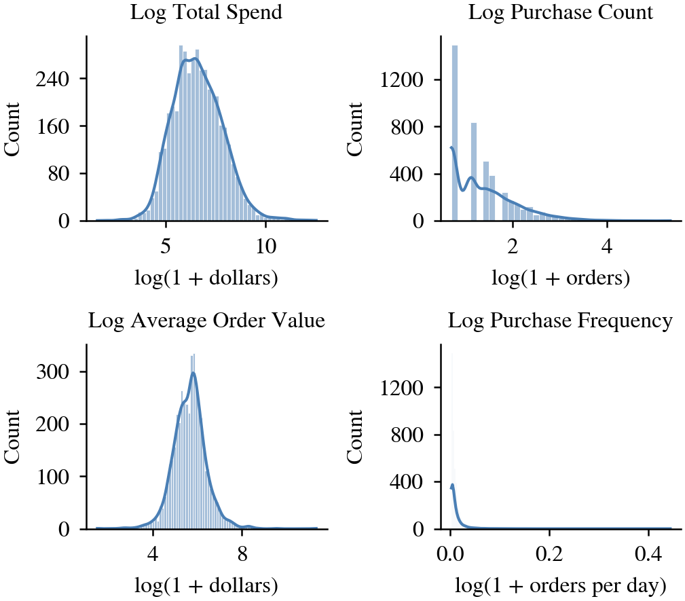
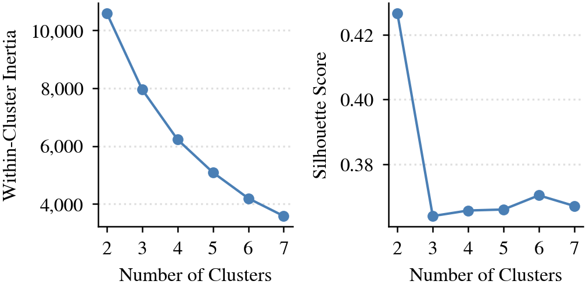
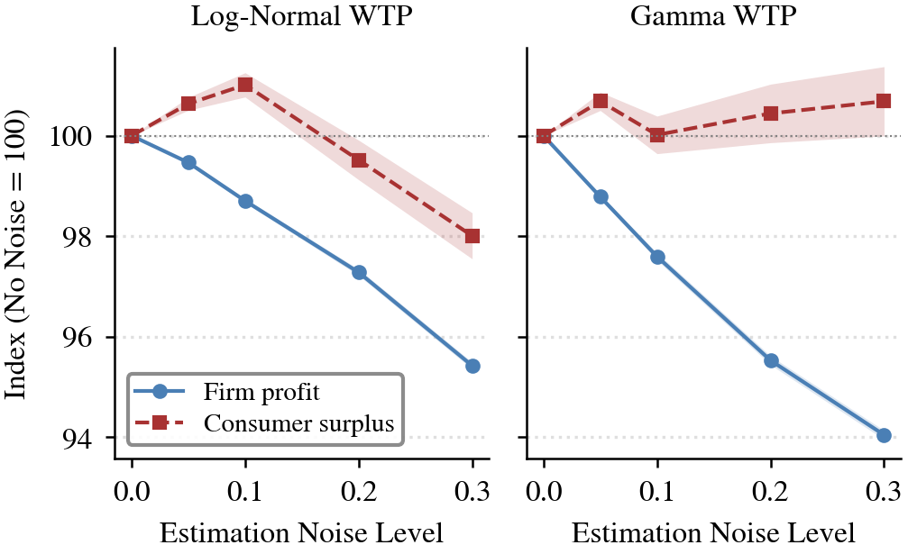

# Who Pays for Imprecision?

### Willingness-to-Pay Estimation Error, Segmented Pricing, and Consumer Welfare

This repository contains the computational analysis for a research project studying a simple question:

> **What happens to firm pricing, profit, purchasing, and consumer welfare when willingness-to-pay (WTP) estimates become less precise?**

The analysis combines customer segmentation, simulated willingness-to-pay, profit-maximizing segmented prices, and Monte Carlo experiments to examine how estimation error propagates through a pricing system.

[Open the analysis notebook](./wtp_noise_analysis.ipynb)

## Research design

The notebook begins with the **UCI Online Retail** transaction dataset and builds customer-level behavioral profiles from observed purchasing activity.

### Data

The source dataset contains **541,909 transaction-line records**. After removing cancellations, non-positive quantities, and non-positive prices, the analysis retains **530,104 cleaned records** representing **4,338 customers** across a 373-day observation window.

Customer profiles include:

- total spend;
- purchase count;
- average order value; and
- purchase frequency.

Because these variables are highly skewed, the clustering stage uses log-transformed features and standardization.

## Customer segmentation

Customers are segmented with **K-means clustering**. The notebook evaluates alternative cluster counts using inertia and silhouette scores, then uses a three-cluster specification for the simulation.

The resulting clusters are interpreted as **Low**, **Medium**, and **High** customer segments based on spending behavior.

| Segment | Customers | Mean total spend | Mean purchase count |
| --- | ---: | ---: | ---: |
| Low | 1,889 | $282.44 | 1.57 |
| Medium | 2,016 | $1,759.65 | 3.74 |
| High | 433 | $11,155.71 | 18.51 |

## Modeling willingness to pay

Observed spending is not treated as directly equivalent to latent WTP.

The primary simulation generates positive WTP values using a **log-normal distribution** parameterized from segment-level spending behavior, with observed total spend used as a lower bound. A **gamma-distribution specification** is implemented as a robustness check.

This lets the experiment test whether the qualitative results depend heavily on one distributional assumption.

## Introducing estimation error

The firm does not observe true WTP directly. Instead, estimated WTP is modeled as true WTP plus normally distributed estimation error, with the error scale proportional to the customer's true WTP.

The experiment evaluates noise levels of:

`0%` · `5%` · `10%` · `20%` · `30%`

At each noise level, customers are assigned to pricing terciles based on estimated WTP. The model then searches a grid of candidate prices and chooses the price that maximizes expected profit within each estimated segment.

A customer purchases when true WTP is at least the assigned price.

For each simulation the notebook records:

- average firm profit;
- average consumer surplus;
- total surplus;
- purchase rate;
- segment-level profit;
- segment-level consumer surplus;
- segment-level purchase rates; and
- chosen prices.

## Monte Carlo experiment

To distinguish systematic effects from a single random realization, the experiment runs **1,000 simulations at each noise level** for both the log-normal and gamma WTP specifications.

The random seed is fixed for reproducibility.

## Results from the committed notebook

Under the primary log-normal specification, increasing WTP-estimation noise from 0% to 30% is associated with:

- average profit declining from **790.53 to 754.36** (about **4.6%**);
- overall purchase rate declining from **73.63% to 70.34%** (about **3.3 percentage points**);
- average consumer surplus rising slightly at low noise before falling to **1,927.54** at 30% noise; and
- the price chosen for the highest estimated-WTP tercile rising from **3,289.81 to 3,905.42** (about **18.7%**).

The non-monotonic consumer-surplus response is important: more estimation error does not affect every customer or welfare measure in the same direction. The notebook therefore reports both aggregate and segment-level outcomes rather than treating estimation accuracy as a one-dimensional effect.

These values are **simulation results from the model in this repository**, not causal estimates of real-world pricing behavior.

## Figures

### Distributions before transformation


### Log-transformed features


### Choosing the number of clusters


### Estimation noise, profit, and consumer surplus


High-resolution TIFF versions are also available in `figures/tiff/`.

## Reproduce the analysis

The notebook is designed for Google Colab and retrieves the UCI Online Retail dataset directly from its public source.

Core Python libraries used include:

- pandas
- NumPy
- Matplotlib
- seaborn
- scikit-learn

Run `wtp_noise_analysis.ipynb` from top to bottom to reproduce the cleaning, segmentation, WTP construction, simulations, and figures.

## Methodological limitations

This is a simulation-based study, so its conclusions depend on the model design.

Important limitations include:

- latent WTP is simulated rather than directly observed;
- historical spending is used to parameterize WTP distributions;
- the spending floor imposed on simulated WTP is a modeling assumption;
- K-means imposes a particular segmentation structure;
- the firm's pricing rule is stylized;
- estimation error is modeled with a specific noise process; and
- the retail dataset represents a particular historical setting and should not be treated as a representative sample of all consumers or markets.

The gamma robustness check helps test distributional sensitivity, but it does not eliminate these limitations.

## Repository structure

```text
wtp-estimation-error-research/
├── wtp_noise_analysis.ipynb
├── figures/
│   ├── png/
│   └── tiff/
├── LICENSE
└── README.md
```

## Why this project

I was interested in the gap between a model being *useful* and a model being *precise*. Pricing systems increasingly depend on estimates of customer behavior, but those estimates inevitably contain error. This project uses simulation to explore how that uncertainty can change decisions and distribute gains and losses differently across customers.
